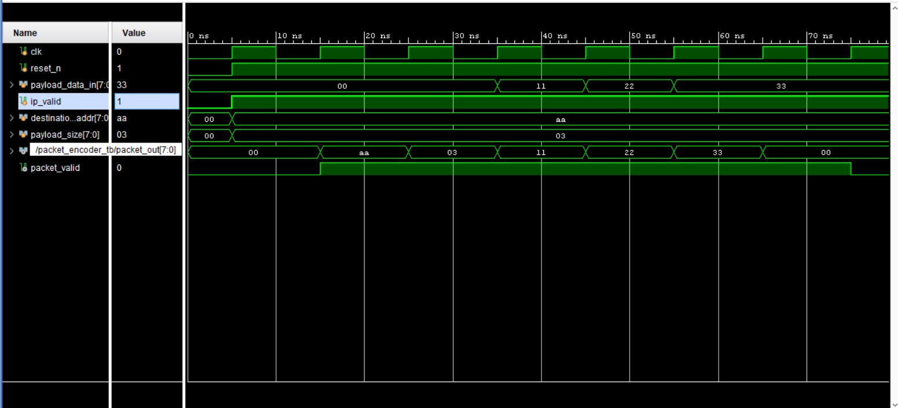

# Packet Encoder – Verilog RTL

## Overview

This project implements a Packet Encoder using Verilog RTL.

The packet encoder receives a destination address, payload size, and payload data, and generates the packet sequentially using a Finite State Machine (FSM).

## Features

- FSM-based packet encoding
- Destination address transmission
- Payload size transmission
- Payload data transmission
- Parity generation
- Packet valid signal
- Sequential packet transmission
- Verilog RTL implementation

## Packet Structure

The packet is transmitted in the following order:

1. Destination Address
2. Payload Size
3. Payload Data
4. Parity

Each field is transmitted as an 8-bit value.

## Architecture

The design contains:

1. FSM control logic
2. Destination address register
3. Payload size register
4. Payload counter
5. Parity generation logic
6. Packet output logic
7. Packet valid generation

## FSM States

The packet encoder uses five states:

- `IDLE` – Waits for a valid packet
- `HEADER_ADDR` – Sends the destination address
- `HEADER_SIZE` – Sends the payload size
- `PAYLOAD` – Sends the payload data
- `PARITY` – Sends the generated parity

## Project Structure

```text
packet-encoder-verilog/
│
├── rtl/
│   └── packet_encoder.v
│
├── testbench/
│   └── packet_encoder_tb.v
│
├── packet_encoder_waveforms.png
│
└── README.md
```
## Verification

The design is verified using a Verilog testbench.

The testbench provides:

- Destination address
- Payload size
- Multiple payload data values
- Packet valid input

The simulation waveform demonstrates the packet encoding sequence and `packet_valid` signal.

## Simulation Result

The waveform shows the transmission of:
```
Destination Address
        ↓
    Payload Size
        ↓
   Payload Data
        ↓
      Parity
```


## Tools Used

- Verilog HDL
- RTL Simulation
- ModelSim / Vivado

## Concepts Demonstrated

- Finite State Machine (FSM)
- Sequential logic
- Combinational logic
- Packet encoding
- Parity generation
- Counters
- Testbench development
- RTL simulation

## Author

**Rohith Kumar**

Aspiring Design Verification Engineer
